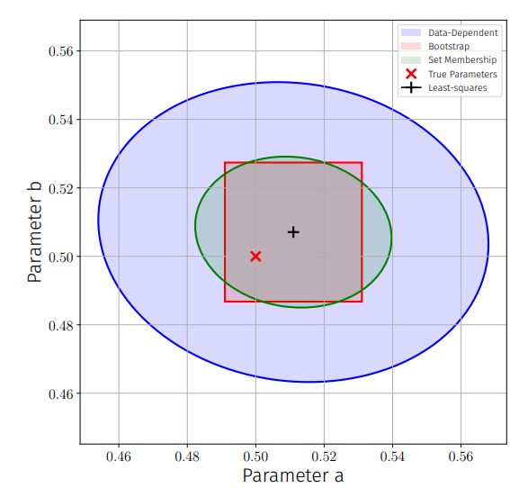
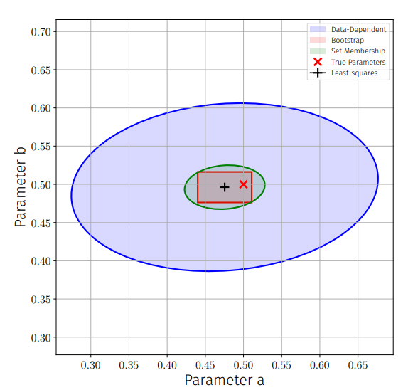
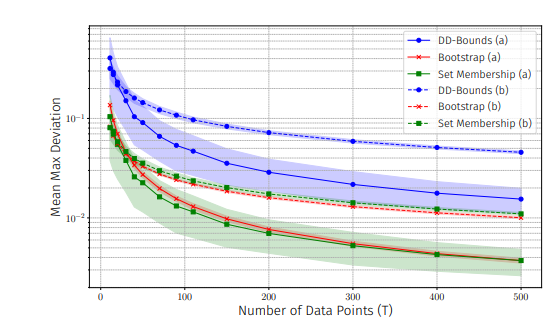

# System Identification and Uncertainty Quantification for LTI Systems


This repository contains the source code for my bachelor's thesis, **"Comparison of the impact of measurement uncertainties on data-driven control"**.

The project implements and analyzes advanced System Identification and Set Membership techniques for Linear Time-Invariant (LTI) systems. It focuses on characterizing model uncertainty using three distinct approaches:
1. **Analytical Data-Dependent Bounds** (High theoretical guarantees, conservative)
2. **Bootstrap Resampling** (Data-driven, precise, robust)
3. **Set Membership Identification** (Worst-case deterministic bounds)

---

## 📊 Visualizations & Key Results

### 1. Qualitative Analysis: I.I.D. vs. Trajectory Data
The shape of the uncertainty regions differs significantly depending on the data paradigm.

**I.I.D. Data:**
In the independent sampling scenario, the uncertainty is distributed evenly. The **Bootstrap** (red rectangle) and **Set Membership** (green ellipse) methods produce tight regions around the true parameters.



**Trajectory Data:**
When using correlated trajectory data, the ellipses become tilted due to the correlation between parameters. The **Data-Dependent Bounds** (blue) remain highly conservative compared to the other methods.




### 2. Quantitative Performance: The "Marginally Stable" Case
A key finding of this thesis is the reliability trade-off in systems near the stability boundary ($a=0.99$).

The plot below shows the mean axis-aligned deviation. While **Set Membership** (green) is precise on average, it exhibits **high variance** (large shaded area) in this challenging scenario. The **Bootstrap method** (red) proves to be the most robust, offering consistent results with low variance.


*(Fig: Comparison of mean axis-aligned deviation for a marginally stable system (a=0.99). The shaded areas represent the standard deviation across 500 Monte Carlo runs.)*
---

## Project Structure

The codebase is organized into a modular architecture to ensure a clear separation of concerns between core logic, experiment orchestration, and post-analysis reporting.

```
.
├── experiments/      # Contains all executable experiment scripts
│   ├── single_runs/  # Scripts for isolated test runs of individual methods
│   └── ...           
├── analysis/        # Scripts for post-simulation analysis and visualization
├── src/              # Core library with all reusable functions and classes
├── results/          # Output directory for all generated artifacts (CSVs, plots)
├── data/             # Directory for temporary, generated datasets
├── main.py           # Central command-line interface (CLI) to run all experiments
├── requirements.txt  # Python package dependencies
└── README.md         # This documentation file
```

---

## Core Modules (`src/`) Overview

The `src/` directory contains the foundational code of the project, organized into specialized modules:

* **`data_generation.py`**: Provides functions to generate synthetic test data, supporting both i.i.d. samples (`generate_iid_samples`) and time-series trajectories (`generate_time_series_data`).

* **`system_identification.py`**: Contains the core algorithms for parameter estimation. This includes Least-Squares estimators tailored for both i.i.d. and time-series data, as well as the respective parametric bootstrap analysis procedures.

* **`set_membership.py`**: Implements the logic for Set-Membership identification. Its primary component is `calculate_ellipse_from_qmi`, which analytically derives the confidence ellipse directly from the Quadratic Matrix Inequality (QMI) formulation.

* **`analysis.py`**: Defines the object-oriented analysis classes (`ConfidenceEllipse`, `ConfidenceRectangle`). These classes encapsulate a given confidence region and provide a standardized interface for calculating key performance metrics (`.area()`, `.worst_case_deviation()`) and validating coverage (`.contains()`).

* **`plotting.py`**: A dedicated library of reusable plotting functions. These are designed to accept `pandas` DataFrames and produce consistent, high-quality visualizations for the various experiments and analyses.

---

## Setup and Installation

The project requires Python 3.10 or newer.

**1. Create a Virtual Environment:**
From the project's root directory, create a new virtual environment.
```bash
python -m venv .venv
```

**2. Activate the Environment:**
* **Windows (PowerShell):**
    ```powershell
    .\.venv\Scripts\Activate.ps1
    ```
* **macOS / Linux:**
    ```bash
    source .venv/bin/activate
    ```

**3. Install Dependencies:**
With the environment activated, install all required packages from the `requirements.txt` file.
```bash
pip install -r requirements.txt
```

---

## Usage: Running Experiments

All experiments are launched via the central command-line interface, `main.py`. The general syntax is:

`python main.py <experiment_name> [options]`

### Key Experiments (`<experiment_name>`)

#### 1. Monte Carlo Comparisons (Main Results)

These experiments run a full Monte Carlo simulation to compare the performance of different methods over a range of data points.

* `iid_comparison`:
    Compares all **I.I.D.-based methods**: Dean DD-Bounds, Bootstrap (I.I.D.), and Set-Membership (I.I.D.).
* `trajectory_comparison`:
    Compares all **trajectory-based methods**: Tsiams DD-Bounds, Bootstrap (Trajectory), and Set-Membership (Trajectory).

    * **Option for both:** Use `--runs <number>` (e.g., `--runs 100`) to specify the number of Monte Carlo repetitions.

#### 2. Statistical Validation

These experiments analyze the statistical properties of the identification methods.

* `coverage_iid`:
    Validates the empirical coverage probability for the **I.I.D.-based methods** across a range of sample sizes `N`.
* `coverage_trajectory`:
    Performs the same coverage validation for the **trajectory-based methods** across different trajectory lengths `T`.
* `dd_bounds_calibration`:
    Runs the calibration experiment for the constant `C` in the Dean et al. Data-Dependent Bounds to find an empirically tighter value.

#### 3. Single Test Runs (For Visualization & Debugging)

The following commands execute a single run of the specified method, producing a plot of the resulting confidence region.

* **I.I.D. Methods:**
    * `dd_bounds_iid`
    * `bootstrap_iid`
    * `set_membership_iid`
* **Trajectory-Based Methods:**
    * `dd_bounds_trajectory`
    * `bootstrap_trajectory`
    * `set_membership_trajectory`

#### Example Invocation:
```bash
# Run the main comparison of all trajectory-based methods with 50 Monte Carlo repetitions.
python main.py trajectory_comparison --runs 50
```
